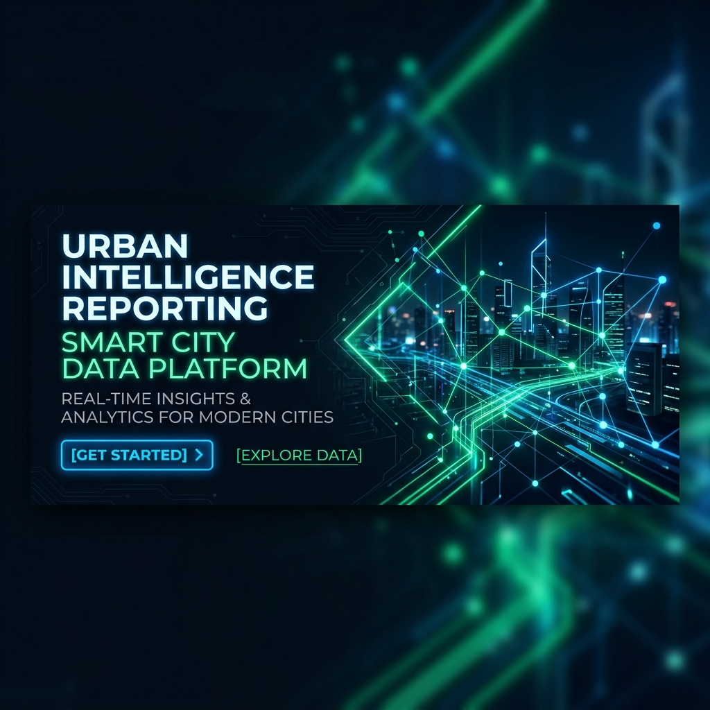

🇮🇩 Bahasa Indonesia | [🇺🇸 English](./README.en.md)

# Kota Pintar (Smart City) 🏙️



[](https://fastapi.tiangolo.com/)
[](https://reactjs.org/)
[](https://www.mongodb.com/)
[](https://deepmind.google/technologies/gemini/)

**Kota Pintar** adalah platform pelaporan masalah publik terintegrasi yang dirancang untuk menjembatani komunikasi antara warga dan dinas pemerintah kota. Dengan bantuan kecerdasan buatan (Gemini AI), sistem secara otomatis mengklasifikasikan laporan dan mengarahkannya (smart routing) ke dinas yang relevan secara real-time.

---

## 🚀 Fitur Utama

- **Pelaporan Berbasis AI**: Warga dapat mengirimkan laporan dengan foto dan lokasi GPS. Gemini AI akan menganalisis teks serta gambar untuk menentukan kategori, tingkat urgensi, sentimen, dan ringkasan laporan secara otomatis.
- **Smart Routing & SLA**: Laporan otomatis dialokasikan ke dinas terkait (misalnya Dinas Pekerjaan Umum untuk jalan rusak) dengan batas waktu penyelesaian (SLA) yang disesuaikan secara dinamis.
- **Peta Kota Interaktif**: Visualisasi laporan di seluruh kota menggunakan Leaflet Map dengan penanda warna sesuai tingkat urgensi.
- **Dashboard Multi-Role**:
  - **Warga**: Mengirim laporan, melacak status, memberikan suara (upvote), dan berdiskusi pada kolom komentar.
  - **Petugas**: Mengelola tugas, memperbarui progress kerja, dan memberikan klarifikasi penyelesaian.
  - **Admin**: Mengelola data dinas, petugas, aturan routing otomatis, serta melihat analisis KPI kota.
- **Notifikasi Real-time**: Komunikasi instan dua arah menggunakan protokol WebSocket untuk pembaruan status dan komentar baru.

---

## 📸 Galeri & Tampilan Aplikasi

Berikut adalah beberapa tampilan utama dari aplikasi **Kota Pintar**:

### Halaman Utama & Dashboard Warga
| Halaman Landing | Dashboard Warga |
|---|---|
|  |  |

### Pengiriman Laporan & Detail Laporan
| Form Pengiriman Laporan | Detail Laporan Warga |
|---|---|
|  |  |

### Halaman Admin & Dinas
| Dashboard Antrean Keluhan (Admin) | Dashboard Manajemen Petugas (Admin) |
|---|---|
|  |  |

### Peta Interaktif & Visualisasi Wilayah
| Peta Interaktif (Leaflet) | Laporan per Wilayah |
|---|---|
|  |  |

---

## 🛠️ Arsitektur Teknologi

### Frontend
- **React 18** (Single Page Application)
- **Tailwind CSS** (Modern responsive design)
- **Leaflet & React-Leaflet** (Peta interaktif)
- **Axios & WebSocket API** (Komunikasi data)

### Backend
- **FastAPI** (Python async framework)
- **Pydantic** (Validasi tipe data)
- **Motor** (Async MongoDB Driver)
- **Google Gemini AI** (Klasifikasi & analisis gambar)

### Database & OS
- **MongoDB** (NoSQL Document Store)
- **Supervisor** (Process control manager)
- **Docker & Kubernetes** (Siap untuk deployment skala besar)

---

## 📁 Struktur Proyek

```
/
├── backend/                  # FastAPI Application
│   ├── server.py             # Entrypoint & REST/WS API
│   ├── auth.py               # JWT & bcrypt Authentication
│   ├── ai_service.py         # Integrasi Gemini AI
│   ├── storage_client.py     # Penyimpanan Media Lokal
│   ├── models.py             # Skema Pydantic
│   └── tests/                # Unit & Integration Tests
│
├── frontend/                 # React SPA Application
│   ├── public/               # File Statis HTML
│   ├── src/                  # Sumber Kode React
│   │   ├── components/       # Komponen Reusable
│   │   ├── pages/            # Halaman Dashboard & Landing
│   │   ├── lib/              # Helper API, Auth, WS
│   │   └── hooks/            # Custom Hooks
│   └── package.json          # Package Dependencies
│
└── tests/                    # Global Test Configuration
```

---

## 🔧 Panduan Instalasi Cepat

Untuk panduan detail dan konfigurasi environment, silakan merujuk ke [SETUP_GUIDE.md](./docs/SETUP_GUIDE.md).

### Prasyarat
- Python 3.11+
- Node.js 18+
- MongoDB Server running

### Langkah Menjalankan

1. **Clone repositori dan masuk ke direktori proyek**:
   ```bash
   git clone https://github.com/YotaGod/Kabarin.git
   cd Kabarin
   ```

2. **Jalankan Backend**:
   ```bash
   cd backend
   pip install -r requirements.txt
   # Sesuaikan file .env Anda
   python server.py
   ```

3. **Jalankan Frontend**:
   ```bash
   cd ../frontend
   npm install
   # Sesuaikan file .env Anda
   npm run start
   ```

---

## 📚 Tautan Dokumentasi Terkait

Untuk pemahaman mendalam tentang arsitektur, deployment, dan API, silakan baca dokumen berikut:

- [SETUP_GUIDE.md](./docs/SETUP_GUIDE.md) - Panduan instalasi dan seeding data.
- [ARCHITECTURE.md](./docs/ARCHITECTURE.md) - Detail desain sistem, database, dan diagram Mermaid.
- [API_DOCUMENTATION.md](./docs/API_DOCUMENTATION.md) - Spesifikasi lengkap endpoint REST & WebSocket.
- [SECURITY.md](./docs/SECURITY.md) - Kebijakan keamanan, hashing, dan RBAC.
- [TESTING_GUIDE.md](./docs/TESTING_GUIDE.md) - Informasi pengujian backend menggunakan Pytest.
- [MAINTENANCE_GUIDE.md](./docs/MAINTENANCE_GUIDE.md) - Prosedur monitoring dan backup berkala.
- [ROADMAP.md](./docs/ROADMAP.md) - Rencana pengembangan fitur jangka panjang.
