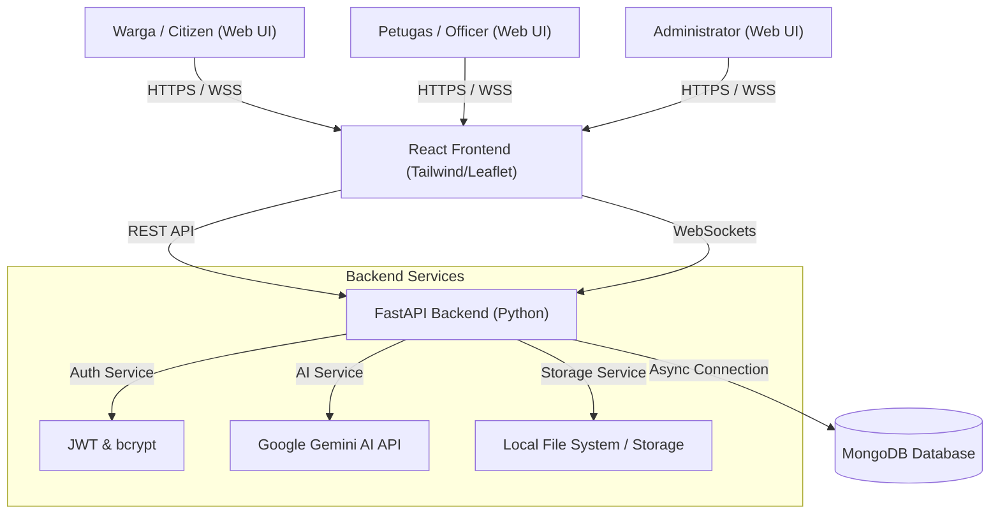
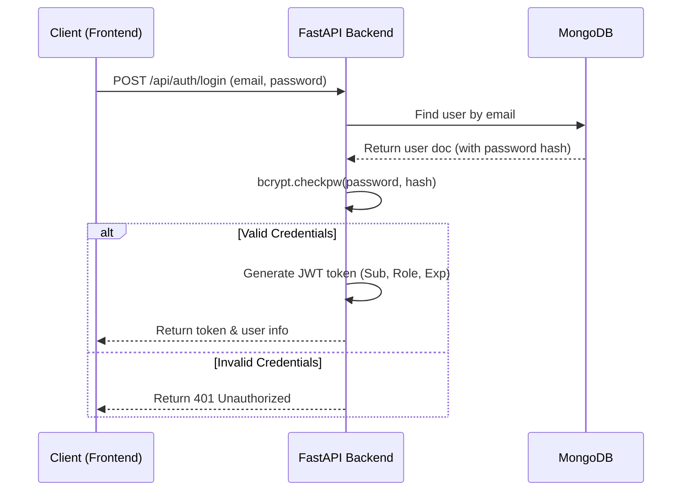

# System Architecture & Design (ARCHITECTURE) 🏗️

This document details the high-level architecture, data models, security flows, and deployment configurations of the **Kota Pintar** application.

---

## 🏛️ System Overview

The application follows a standard **3-Tier Architecture** structure:

1. **Presentation Layer (Frontend)**: React Single Page Application (SPA) utilizing Tailwind CSS for UI presentation, Leaflet for mapping, and Axios/WebSockets for API communications.
2. **Application Layer (Backend)**: Async FastAPI (Python 3.11+) server managing business logic, authenticating clients, calling Google Gemini AI for smart classification, and broadcasting real-time updates.
3. **Database Layer (Persistence)**: MongoDB NoSQL database storing users, reports, routing rules, notifications, and comments.



---

## 🔐 Authentication & Authorization Flow

### JWT Authentication Flow
The system uses stateless JSON Web Token (JWT) authentication:
1. The client sends a login request with credentials.
2. The server verifies the password using `bcrypt` and generates a signed JWT payload (subject, role, email, and expiration time).
3. The token is sent back to the frontend, which stores it in `localStorage` as `sc_token`.
4. Subsequent requests include the token in the `Authorization: Bearer <token>` header.

### Role-Based Access Control (RBAC)
FastAPI dependencies intercept incoming requests to verify user roles:
- `citizen`: Can create reports, upvote, and comment.
- `officer`: Can view reports in their designated department, update reports' lifecycle status, and comment.
- `admin`: Full administrative access (can manage departments, officers, routing rules, and view global analytics).



---

## 🗄️ Database Design (MongoDB Schema)

The database utilizes UUIDs instead of MongoDB ObjectIds for better portability and custom indexing.

### Collections

#### 1. `users`
Stores user profile information:
```json
{
  "id": "UUID-String",
  "name": "Full Name",
  "email": "user@email.com",
  "password_hash": "$2b$12$...",
  "role": "citizen | officer | admin",
  "phone": "08123...",
  "department_id": "UUID-String (Null for citizens)",
  "created_at": "ISODate"
}
```

#### 2. `reports`
Maintains records of submitted citizen issues:
```json
{
  "id": "UUID-String",
  "title": "Title of report",
  "description": "Details...",
  "status": "Submitted | AI Classified | Assigned | In Progress | Under Review | Resolved | Closed",
  "category": "Kerusakan Jalan",
  "urgency": "Kritis | Tinggi | Sedang | Rendah",
  "sentiment": "Darurat | Keluhan | Saran | Informasi",
  "latitude": -6.2088,
  "longitude": 106.8456,
  "address": "Street Name",
  "media_urls": ["/uploads/file.png"],
  "citizen_id": "UUID-String",
  "assigned_officer_id": "UUID-String (Null initially)",
  "department_id": "UUID-String",
  "priority_score": 75.0,
  "upvotes": ["UUID-of-citizen-1"],
  "sla_deadline": "ISODate",
  "resolved_at": "ISODate (Null initially)",
  "created_at": "ISODate"
}
```

#### 3. `departments`
Stores departments responsible for resolving issues:
```json
{
  "id": "UUID-String",
  "name": "Dinas Kebersihan",
  "categories": ["Sampah", "Masalah Lingkungan"],
  "contact": "0812...",
  "created_at": "ISODate"
}
```

---

## 🌐 API & WebSocket Communications

- **REST API**: Handles structured, request-response transactions such as reporting issues, updating status, and administrative operations.
- **WebSocket Protocol (`/ws/{user_id}`)**: Establishes a persistent TCP connection between client and server. When state changes occur (e.g. a report status shifts from "In Progress" to "Resolved"), the backend sends JSON payloads to relevant connected clients to update counts and trigger immediate browser notifications without page reloading.

---

## 🏗️ Deployment Architecture

In a production environment, the system is designed to run in containerized environments:

- **Docker**: Containerizes FastAPI and React frontend for cross-platform portability.
- **Kubernetes**: Standardizes container orchestration, manages routing through an Ingress controller, and scales the FastAPI API instances based on traffic loads.
- **Supervisor**: Locally handles process management, automatically spawning and restarting `gunicorn`/`uvicorn` backend workers and the static React server daemon.
